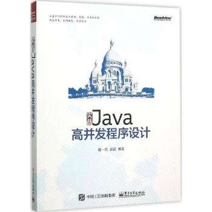
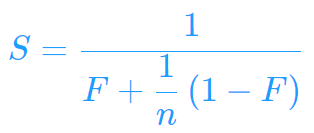
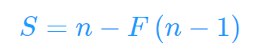

# 《实战Java高并发程序设计》 上的代码
> 葛一鸣 郭超 著

书籍封面：

## 第一章 走入并行世界

并发的几个易混淆的基本概念：

- 死锁（Deadlock）：线程彼此占用着对方想要获得的资源不释放
- 饥饿（Starvation）：一个或多个线程无法获得资源，导致一直无法执行
- 活锁（Livelock）：进程间互相谦让，导致资源不断地在两个线程间跳动，而没有一个线程可以同时拿到所有资源而得到执行

并发级别：

- 阻塞（Blocking）：一个线程是阻塞的，那么在其他线程释放资源之前，当前线程无法执行
- 无饥饿（Starvation-Free）：所有线程都有机会执行
- 无障碍（Obstruction-Free）：最弱的一种非阻塞调度。如果两个线程同时进入临界区，不会导致一方被挂起，一旦检测到共享数据遭到修改，就会立即对自己所做的修改进行回滚，保证数据安全，是一种乐观的策略。一种实现方式是“一致性标记”
- 无锁（Lock-Free）：无锁的并行都是无障碍的，无锁的并发保证必然有一个线程能够在有限步内完成操作离开临界区。即无锁的并行总能保证一个线程可以胜出，不至于全军覆没。
- 无等待（Wait-Free）：无锁只要求有一个线程可以在有限步内完成，而无等待则在无锁的基础上进行扩展。它要求所有的线程都必须在有限步内完成。一种典型的无等待结构是RCU（Read-Copy-Update）

有关并行的两个重要定律：

- Amdahl定律：

  

​         S为加速比（优化前系统耗时/优化后系统耗时），F为程序中串行部分的比例，n为处理器个数

- Gustafson定律：

对比：Amdahl定律强调，当串行比例一定时，加速比是有上限的。

​           Gustafson定律关心的是如果可被串行化的代码所占比重足够多，那么加速比就能随着CPU数量增长。

## 第二章 Java并行程序基础

2.3 volatile与Java内存模型

https://github.com/DQinYuan/javahighconcurrent/blob/master/src/main/java/javahighconcurrent/ch2/NoVisibility.java

## 第三章 JDK并发包

3.2.8 堆栈去哪了：在线程池中寻找堆栈

https://github.com/DQinYuan/javahighconcurrent/tree/master/src/main/java/javahighconcurrent/ch3/threadpool/disappear_error

## 第四章 锁的优化及注意事项

4.4.3 Java中的指针：Unsafe类

获得Unsafe实例的方法：

https://github.com/DQinYuan/javahighconcurrent/blob/master/src/main/java/javahighconcurrent/ch4/unsafe/UnSafeFactory.java

## 第五章 并行模式与算法

5.4 Disruptor相关

​    5.4.2 使用Disruptor实现生产者消费者问题

​         https://github.com/DQinYuan/javahighconcurrent/tree/master/src/main/java/javahighconcurrent/ch5/disruptor/producer_consumer

​    5.4.4 CPU Cache的优化

​        https://github.com/DQinYuan/javahighconcurrent/tree/master/src/main/java/javahighconcurrent/ch5/disruptor/falseshare

5.5 Future模式

https://github.com/DQinYuan/javahighconcurrent/tree/master/src/main/java/javahighconcurrent/ch5/future_model

5.6 并行流水线

https://github.com/DQinYuan/javahighconcurrent/tree/master/src/main/java/javahighconcurrent/ch5/pipeline

5.8 并行排序

https://github.com/DQinYuan/javahighconcurrent/tree/master/src/main/java/javahighconcurrent/ch5/concurrent_sort

5.9 并行算法：矩阵乘法

https://github.com/DQinYuan/javahighconcurrent/tree/master/src/main/java/javahighconcurrent/ch5/matrix_multiply

5.10与5.11   NIO  AIO相关

https://github.com/DQinYuan/javahighconcurrent/tree/master/src/main/java/javahighconcurrent/ch5/network

## 第六章 Java8与并发

6.1与6.2 函数式编程基础

  https://github.com/DQinYuan/javahighconcurrent/tree/master/src/main/java/javahighconcurrent/ch6/introduction

​         方法引用相关Demo:

https://github.com/DQinYuan/javahighconcurrent/tree/master/src/main/java/javahighconcurrent/ch6/methodref

6.4 并行流与并行排序

https://github.com/DQinYuan/javahighconcurrent/tree/master/src/main/java/javahighconcurrent/ch6/parallelstream

6.5 增强的Future: CompletableFuture

https://github.com/DQinYuan/javahighconcurrent/tree/master/src/main/java/javahighconcurrent/ch6/compeletablefuture

6.6 读写锁的改进：StampedLock

https://github.com/DQinYuan/javahighconcurrent/tree/master/src/main/java/javahighconcurrent/ch6/stampedlock

6.7 原子类的增强
https://github.com/DQinYuan/javahighconcurrent/tree/master/src/main/java/javahighconcurrent/ch6/longadder

## 第七章 使用Akka构建高并发程序

https://github.com/DQinYuan/javahighconcurrent/tree/master/src/main/java/javahighconcurrent/ch7_akka

并发粒子群算法的实现：

https://github.com/DQinYuan/javahighconcurrent/tree/master/src/main/java/javahighconcurrent/ch7_akka/PSO

## 第八章 并行程序调试

https://github.com/DQinYuan/javahighconcurrent/tree/master/src/main/java/javahighconcurrent/ch8